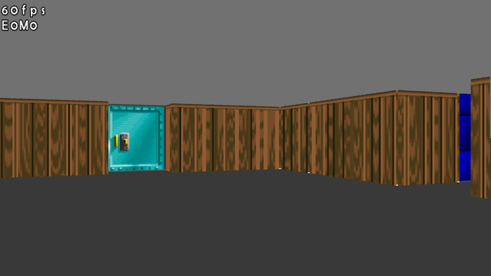
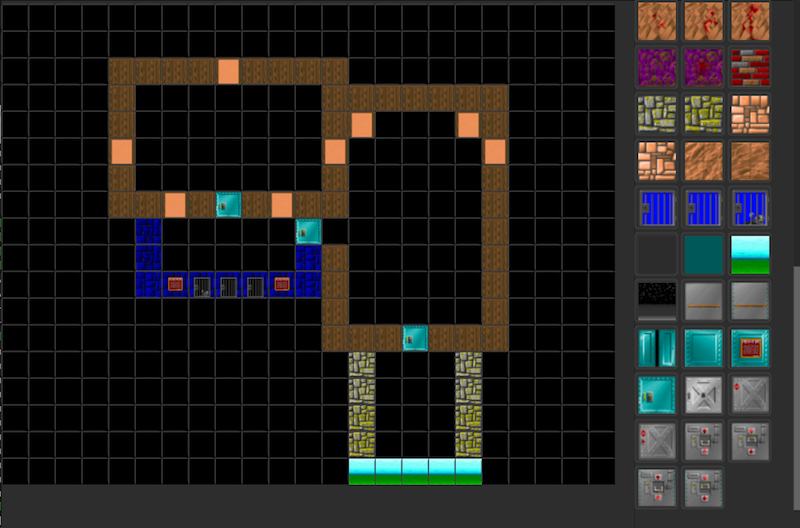

WolfCast
--------

* This is a prototype of a Wolfenstein 3D style raycaster in C/OpenGL.
* Also includes a map editor in C/Nuklear.
* *This project is no longer being developed.*

Code is licensed under 2-Clause BSD.
Contains modified version of [stb](https://github.com/nothings/stb) and [Nuklear](https://github.com/vurtun/nuklear), both originally released into the public domain.

**Engine:**

**Editor:**

